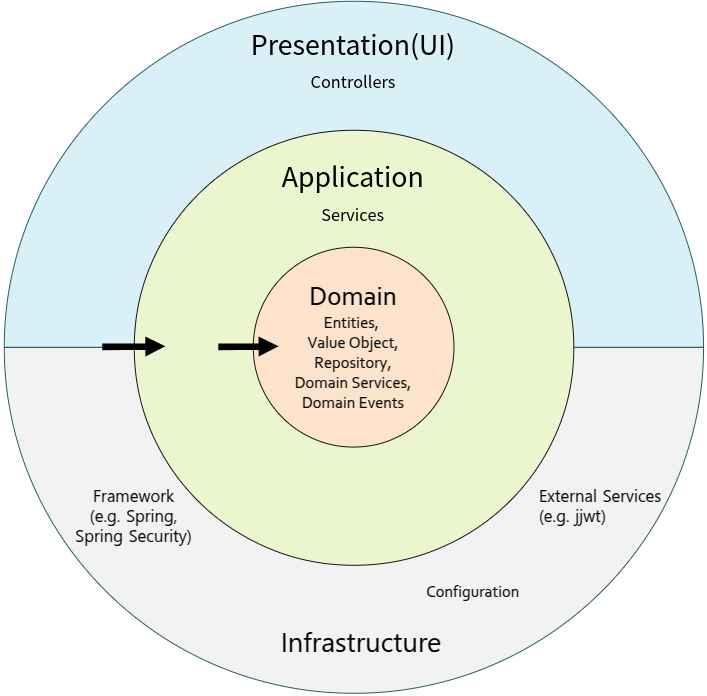
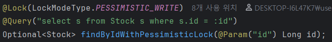
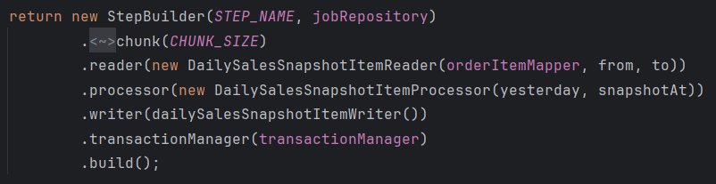
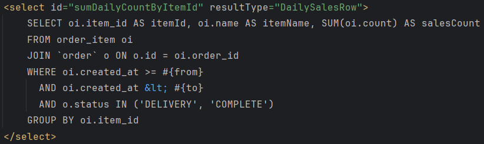
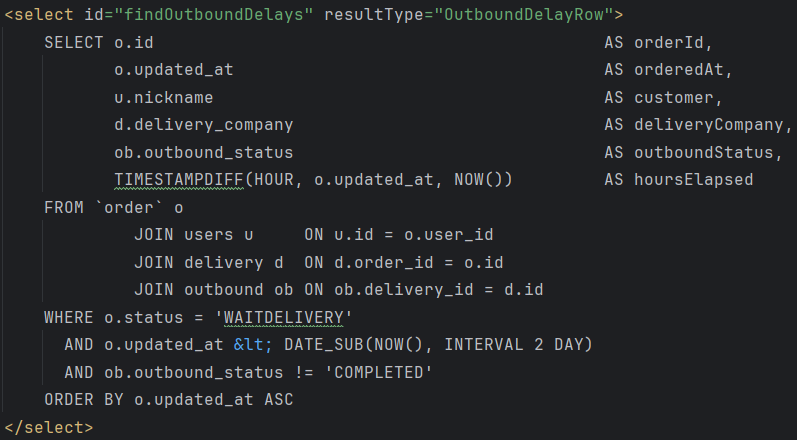

# 물류 이커머스
* '입고 ~ 재고 ~ 주문 ~ 출고' 전반을 다룬다. 
* 기술스택 : SpringBoot, MySQL
* 외부 연동없이, DB안에서 모든 흐름이 닫히도록 설계

해당 README는 작성중(미완성)입니다.

<h2>소프트웨어 아키텍처</h2>

<h3>Rest API 응답 설계</h3>

'HTTP 상태코드' 에 따른 응답
* 2xx은 @controller에서
* 4xx, 5xx 은 @ExceptionHandler 쪽에서
  * 커스텀한 Expected4xxException, Expected5xxException를 api로직에서 throw함
* 응답형식은 ApiResponse클래스로 일괄 처리
  * 정적 팩토리 메서드(Static Factory Method)패턴을 사용

<h3>DB 관련 정책</h3>

(예외상황 있을수 있음)
* FK 사용x , 참조필드에 index를 사용한다.
* JPA를 기본으로 하되    
  동적쿼리, 복잡한 쿼리등은 MyBatis를 이용한다.
* JPA 연관관계는 @ManyToOne(fetch = FetchType.LAZY) 만 사용한다.

## 🎥 주요 기능들

### 입고

  
프로세스

  

    <ol>
      <li> (외부에서 물건 도착한 상황)
      </li>
      <li> 물건 받은 직원이 입고 등록 신청   
      </li>
      <li> 입고, 입고 아이템 생성
      </li>
      <li> (적재 담당자가 창고에 적재 예정)
      </li>
    </ol>
  

  
최종 데이터 변화

  

    <ol>
      <li> Inbound, InboundItem 생성
      </li>
    </ol>
  

#### 입고된 물건 적재

  
프로세스

  

    <ol>
      <li> 직원이 입고된 물건들 조회
      </li>
      <li> (아이템과 자리있는 창고 매핑)   
      </li>
      <li> 창고에 아이템 적재후, 적재 완료요청 
      </li>
      <li> 추가한 재고 증가, 입고아이템 적재 완료 업데이트
      </li>
    </ol>
  

  
최종 데이터 변화

  

    <ol>
      <li> Stock 생성 or 개수 증가
      </li>
      <li> InboundItem 적재 상태, 적재한 직원 업데이트
      </li>
    </ol>
  

### 주문 (결제까지 하는경우)

  
프로세스

  

    <ol>
      <li> 고객이 주문
      </li>
      <li> 장바구니 아이템들 구매가능한지 판단(돈, 재고)   
      </li>
      <li> 주문, 주문 아이템들 생성
      </li>
      <li> 결제(돈 차감, 마트 장부 기록)
      </li>
      <li> 배송 대기상태로(재고 차감, 오더피킹 생성)
      </li>
      <li> (창고직원이 재고 피킹 예정)
      </li>
    </ol>
  

  
최종 데이터 변화

  

    <ol>
      <li> Order, OrderItem 생성
      </li>
      <li> ItemInCart 삭제
      </li>
      <li> Wallet에서 돈 차감, ShopLedgerHistory (입금)생성    
      </li>
      <li> Order 상태 업데이트
      </li>
      <li> Stock에서 개수 차감,  Picking 생성
      </li>
    </ol>
  

주문기능 : [OrderService.java](https://github.com/doriver/food-mart/blob/47321633b10422cabf2a50dc6e70fb6e5a63da7b/src/main/java/com/example/food_mart/modules/order/application/OrderService.java#L27)

#### 주문된 상품들 피킹

  
프로세스

  

    <ol>
      <li> (오더피킹 생성에서 주문 아이템이 재고에 매핑 된다)
      </li>
      <li> (직원이 피킹 목록을 조회하고, 대기중인 피킹들에 대해 작업한다)
      </li>
      <li> (창고에 있는 재고를 출고장소로 옮긴뒤) 피킹 완료 요청을 한다.
      </li>
    </ol>
  

  
최종 데이터 변화

  

    <ol>
      <li> Picking 상태와 담당직원 업데이트
      </li>
    </ol>
  

### 출고

  
프로세스

  

    <ol>
      <li> (직원이 출고처리 하는 장소에서, 주문에 해당하는 상품들이 다 있는지 확인)
      </li>
      <li> 주문의 도착지, 배송회사 등등 입력해서 출고등록 요청
      </li>
      <li> (출고 등록 완료됨) 
      </li>
      <li> 배송 회사가 물건 가지고가는거 확인하고, 출고 완료요청
      </li>
    </ol>
  

  
최종 데이터 변화

  

    <ol>
      <li> Delivery 생성
      </li>
      <li> Outbound 생성
      </li>
      <li> Outbound 상태와 담당직원 업데이트
      </li>
    </ol>
  

## 📄 세부 기능들

  
재고 개수 변화

  

    <ul>
      <li> 입고된 물건 적재후, 증가
      </li>
      <li> 주문 결제후 배송대기 상태로에서, 감소
      </li>
    </ul>
    수정하려는 재고를 PK로 for update조회해서 Record X-Lock을 획득후 개수 변경
  

  

  
상품들 일별 판매량 스냅샷

  

    <ul>
      <li> batch프레임워크 사용
      </li>
      
      <li> 스냅샷 데이터(해당 아이템, 판매개수, 날짜) 조회
      </li>
      
    </ul>
  

  
출고 지연 탐지

  : 주문 결제후 48시간이 지났는데, 출고가 완료되지 않은 주문들 조회
  

